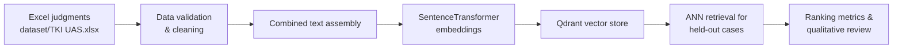

# Legal Case Retrieval for Tindak Pidana Korupsi

[](https://drive.google.com/uc?export=download&id=YOUR_DATASET_FILE_ID)
[](retrieval.ipynb)
[](https://colab.research.google.com/github/YOUR_USERNAME/YOUR_REPO/blob/main/retrieval.ipynb)

> Replace the `YOUR_DATASET_FILE_ID` and repository placeholders with your shared Google Drive and GitHub/Colab locations before publishing.

This project builds a retrieval system for Indonesian corruption (TPK) court decisions. It cleans structured Excel data, assembles rich textual representations per judgment, embeds them with `sentence-transformers/all-mpnet-base-v2`, and stores the vectors in a managed Qdrant cluster for semantic search. A held-out set of cases is used to quantify retrieval quality via Precision, Recall, and NDCG at multiple `k` values.

## Project Snapshot

- **Dataset:** 49 corruption judgments × 26 attributes (`dataset/TKI UAS.xlsx`), with key fields `nomor`, `nama pengadilan negeri`, `petunjuk bb`, and `putusan` driving retrieval.
- **Notebook:** `retrieval.ipynb` orchestrates EDA, preprocessing, embedding, vector upload, and evaluation in an executable, step-by-step workflow.
- **Vector Store:** Remote Qdrant collection (`tki_cases_v1`) populated with normalized 768D embeddings from `all-mpnet-base-v2`.
- **Evaluation:** 20% of records held out for ranking quality checks; metrics logged directly in the notebook and summarized below.

## Pipeline Overview

- **Data ingestion** – Load the curated Excel file and validate expected columns and missing values.
- **Cleaning & enrichment** – Parse JSON-like evidence arrays, trim whitespace, and build a consolidated `combined_text` per record.
- **Embedding generation** – Encode `combined_text` with `sentence-transformers/all-mpnet-base-v2`, returning normalized vectors.
- **Vector storage** – Upsert embeddings and metadata payloads into a hosted Qdrant collection for low-latency ANN search.
- **Evaluation & inspection** – Run hold-out queries against the vector index, compute Precision/Recall/NDCG@K, and inspect ranked hits for qualitative validation.



## Repository Layout

- `retrieval.ipynb` – End-to-end workflow (EDA → preprocessing → embeddings → vector upload → evaluation).
- `dataset/TKI UAS.xlsx` – Source judgments exported from the TPK dataset.
- `plots/` – (Optional) space for persisted visualisations if you save figures beyond inline notebook output.
- `retrieval/` – Python virtual environment (auto-generated); keep it out of version control in shared repos.

## Environment Setup

1. **Create / activate a virtual environment** (example mirrors the checked-in `retrieval` env):

	```powershell
	py -3.12 -m venv retrieval
	.\retrieval\Scripts\Activate.ps1
	```

2. **Install dependencies:**

	```powershell
	pip install pandas numpy scikit-learn matplotlib sentence-transformers qdrant-client openpyxl notebook
	```

3. **Configure secrets (recommended):**

	```powershell
	# Example: store your credentials once per session
	$env:QDRANT_URL = "https://<your-cluster>.gcp.cloud.qdrant.io:6333"
	$env:QDRANT_API_KEY = "<api-key>"
	```

	Update `retrieval.ipynb` to read from environment variables instead of the hard-coded key (`os.environ['QDRANT_API_KEY']`). Rotate the existing key to mitigate accidental exposure.

## Running the Notebook

- Launch Jupyter: `jupyter notebook retrieval.ipynb`
- Execute cells sequentially. Hugging Face will automatically pull `sentence-transformers/all-mpnet-base-v2` when the embedding block runs.
- Ensure the Qdrant collection name (`tki_cases_v1`) is unique for your account if multiple experiments run in parallel.
- To reproduce the evaluation, keep the provided `random_state=42` for the train/test split.

## Evaluation Highlights

**Ranking metrics (20% hold-out):**

| K | Precision@K | Recall@K | NDCG@K |
| --- | --- | --- | --- |
| 1 | 1.0000 | 1.00 | 1.00 |
| 3 | 0.3333 | 1.00 | 1.00 |
| 5 | 0.2000 | 1.00 | 1.00 |
| 10 | 0.1000 | 1.00 | 1.00 |

Even though recall is perfect across cut-offs (the correct decision is always retrieved within top-`k`), precision drops as `k` grows—typical for concise corpora where few semantically close neighbours exist. Monitoring Precision@3/5 is useful when designing downstream user interfaces.

**Sample ranked results (query document held out from training):**

| Rank | Doc No | Score | Pengadilan | Nomor Putusan | Putusan snippet | Matches query |
| --- | --- | --- | --- | --- | --- | --- |
| 1 | 30 | 1.0000 | Pengadilan Negeri Jakarta Barat | Nomor 981/Pid.Sus/2021/PN Jkt.Brt | MENGADILI: 1. Menyatakan terdakwa I SALEH FAR... | Yes |
| 2 | 35 | 0.9490 | Pengadilan Negeri Jakarta Barat | Nomor 256/Pid.Sus/2022/PN Jkt.Brt | MENGADILI : 1. Menyatakan terdakwa Hernanda a... |  |
| 3 | 41 | 0.9074 | Pengadilan Negeri Jakarta Barat | Nomor 1054/Pid.Sus/2022/PN Jkt.Brt | MENGADILI:      Menyatakan Terdakwa GHANA SA... |  |
| 4 | 45 | 0.8956 | Pengadilan Negeri Jakarta Barat | Nomor 323/Pid.Sus/2023/PN Jkt.Brt | MENGADILI:      Menyatakan Terdakwa I. MUHAM... |  |
| 5 | 31 | 0.8752 | Pengadilan Negeri Jakarta Barat | Nomor 767/Pid.Sus/2021/PN.Jkt.Brt. | MENGADILI: 1. Menyatakan terdakwa HARUN RASYI... |  |

The relevant case is returned at rank 1 with cosine similarity 1.0, confirming that the embedding space properly clusters decisions with similar fact patterns. Lower-ranked neighbours share venue and charge similarities, offering reviewers additional context.

## Tips for Extension

- **Feature enrichment:** Incorporate additional text fields (`keterangan perkara`, `identitas terdakwa`, etc.) into `combined_text` to supply richer signals.
- **Re-ranking:** Experiment with hybrid retrieval (`bm25 + dense`) or rerankers (e.g., `cross-encoder/ms-marco-*`) for improved precision when the corpus grows.
- **Monitoring:** Persist evaluation summaries (CSV/JSON) and plot outputs under `plots/` to track regressions as you iterate.
- **Automation:** Wrap preprocessing + embedding steps into a Python script or pipeline when moving beyond notebook experimentation.

## Troubleshooting

- **Unicode decoding errors** when opening the Excel file: ensure `openpyxl` is installed and the dataset path does not contain special characters.
- **SentenceTransformer timeouts**: run `embedding_model.encode` with smaller `batch_size` if resources are limited.
- **Qdrant write timeouts**: adjust the `batch_size` or use gRPC (`prefer_grpc=True`) for faster bulk uploads.

## Licensing & Data Availability

- The Google Drive link above should point to the publicly shareable dataset export (keep sensitive data anonymised as required by court data policy).
- Verify you have rights to redistribute the judgments and cite the official source if mandated.

---

Questions or improvement ideas? Open an issue or reach out before expanding the scope (e.g., adding summarisation or question answering layers).
